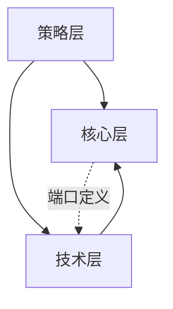

# 依赖规则

## 依赖方向

| 源 | 目标 | 允许 | 说明 |
|----|------|------|------|
| 策略层 | 核心层、技术层 | 是 | 策略层调用核心层接口，组装技术层实现并注入核心层 |
| 核心层 | 技术层 | 否 | 核心层只定义端口，不依赖具体实现 |
| 技术层 | 核心层 | 是 | 技术层实现核心层定义的端口 |
| 同层之间 | — | 视情况 | 核心层内禁止互相依赖，策略层/技术层内可有限依赖 |

---

## 依赖关系图

---

## 变更记录

| 日期 | 变更内容 | 变更人 | 关联变更 |
|------|----------|--------|----------|
| [初始化日期] | 初始版本 | [作者] | — |
