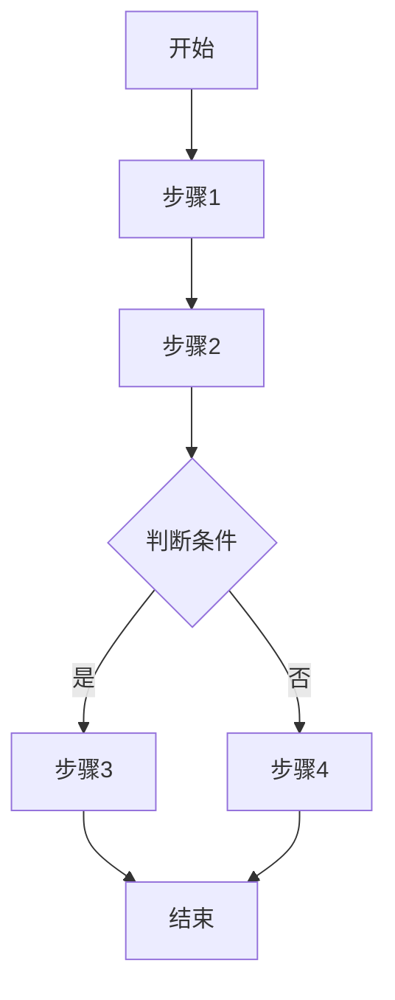

# 业务流程

## [流程名称]

**触发条件**: [什么情况下触发此流程]

**参与者**: [涉及的角色/系统]

**异常处理**:

| 异常场景 | 处理方式 |
|----------|----------|
| [异常1] | [处理方式] |

---

<!-- 按相同格式添加更多流程 -->

---

## 变更记录

| 日期 | 变更内容 | 变更人 | 关联变更 |
|------|----------|--------|----------|
| [初始化日期] | 初始版本 | [作者] | — |
