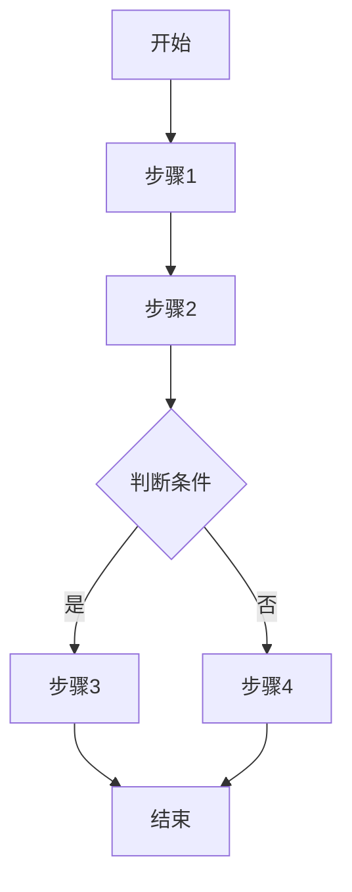
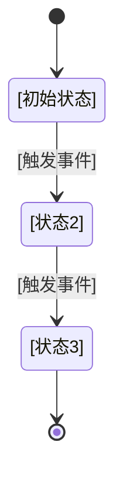

# 业务流程与状态机

> **TL;DR**: 关键流程：[列举 2-3 个]。关键状态机：[哪个实体]。⚠️ [关键状态约束，如"订单一旦支付不可取消"]

---

## 业务流程

### [流程名称]

**触发条件**: [什么情况下触发此流程]

**参与者**: [涉及的角色/系统]

**异常处理**:

| 异常场景 | 处理方式 |
|----------|----------|
| [异常1] | [处理方式] |

---

<!-- 按相同格式添加更多流程 -->

---

## 状态机

### [实体名称] 状态机

**初始状态**: [初始状态名称]

### 状态说明

| 状态 | 含义 | 允许的操作 |
|------|------|------------|
| [状态1] | [描述] | [可执行的操作列表] |

### 转换规则

| 从 | 到 | 触发条件 | 副作用 |
|----|-----|----------|--------|
| [状态1] | [状态2] | [条件] | [如 发送通知、更新字段] |

### 禁止的转换

| 从 | 到 | 原因 |
|----|-----|------|
| [状态1] | [状态3] | [业务原因] |

---

<!-- 按相同格式添加更多状态机 -->

---

## 跨模块事件联动

<!-- 当一个模块的状态变化触发其他模块动作时，必须记录在此 -->
<!-- AI 修改触发方时，必须检查所有受影响方 -->

| 触发方 | 事件 | 受影响方 | 联动动作 | 失败处理 |
|--------|------|----------|----------|----------|
| <!-- 订单 --> | <!-- 支付完成 --> | <!-- 库存 --> | <!-- 扣减库存 --> | <!-- 回滚支付 --> |
| <!-- 订单 --> | <!-- 支付完成 --> | <!-- 物流 --> | <!-- 创建发货单 --> | <!-- 人工处理 --> |

---

## 变更记录

| 日期 | 变更内容 | 变更人 | 关联变更 |
|------|----------|--------|----------|
| [初始化日期] | 初始版本 | [作者] | — |
