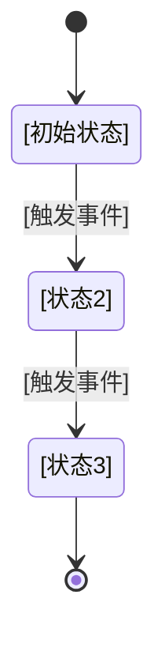

# 状态流转

## [实体名称] 状态机

**初始状态**: [初始状态名称]

### 状态说明

| 状态 | 含义 | 允许的操作 |
|------|------|------------|
| [状态1] | [描述] | [可执行的操作列表] |

### 转换规则

| 从 | 到 | 触发条件 | 副作用 |
|----|-----|----------|--------|
| [状态1] | [状态2] | [条件] | [如 发送通知、更新字段] |

---

<!-- 按相同格式添加更多状态机 -->

---

## 变更记录

| 日期 | 变更内容 | 变更人 | 关联变更 |
|------|----------|--------|----------|
| [初始化日期] | 初始版本 | [作者] | — |
